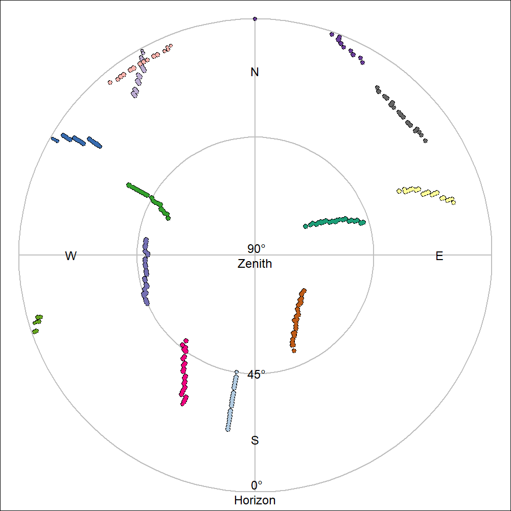

```{r setup, include=FALSE}
knitr::opts_chunk$set(echo = TRUE)
```

# GNSS accuracy & error

## Introduction

A Global Navigation Satellite System (GNSS), also commonly called a Global Positioning System (GPS) which is actually a brand of GNSS, is a relatively easy and affordable way to georeference points.
Georeferencing is the process of associating points on the surface of the Earth to a standardized coordinate system.
This allows us to say the Eiffel Tower is located at 29.9792° N, 31.1342° E using the WGS 84 geographic coordinate system.
This is typically just referred to as a latitude and longitude without any thought to what geographic coordinate system we are using.
While lat/long coordinates can be [extremely precise](https://xkcd.com/2170/) the question this resource aims to explore is how *accurate* are GNSS recording devices and what impacts their accuracy.

A brief reminder of the difference between accuracy and precision:

| Value | Measurement | Definition |
|---|---|---|
|2.017|2.8325|Precise but not accurate|
|2.017|2|Accurate but not precise|
|2.017|2.017|Accurate and precise|
Note that it is better to be accurate than precise.

## Outline
This resource will analyze the data collected along a walk through Belval, LUxembourg, while carrying a GNSS device (Crosscall Trekker-M1 Core).

## Actual path
Below is a walked tour around Belval, starting in the east next to the furnaces, going along the shopping center (Belval Plaza), then to the Park "Um Belval" on the west and returning, ending in front of the Maison des Sciences Humaines (MSH). 

[Belval - not sure we need this](https://www.luxatlas.lu/#b=2362&o=null&f=1071&ob=100&oo=100&of=50&x=662203&y=6360423&z=16.541415223113926). (CHECK WHEN I HAVE WIFI)

Note that the walked path starts and ends in an urban area with tall structures, with some travel trough open green spaces in-between.


**Figure 1: Trace of walked path.**

NEED A NORTH ARROW

The path in the figure above (green line) was manually digitized using QGIS according to the route taken.

## Sensed path - GNSS data

GNSS devices decode satellite signals to determine their location.
THe process locates, with some error, the device and the satellites at a point of time.
This decoding process creates a diversity of data, such as device location (lat/long), location error, and elevation, among others.
This data in raw form is called NMEA data after the organization that defined the standard, the National Marine Electronics Association. There are different versions of the standard.
Rather than nicely structured data it can be quite messy or corrupted and needs further refinement before being easily usable.
Many devices and data analysis tools will process the NMEA data for you so that it is already comprehensible in data or visual form.

```
$GPGSA,A,3,02,04,05,06,07,09,11,16,20,29,30,,1.0,0.6,0.8*3B
$GPVTG,120.2,T,120.2,M,2.9,N,5.4,K,D*2C
$GPRMC,113627,A,4930.382271,N,00556.308064,E,2.9,120.2,271022,1.1,W,D*0E
$GPGGA,113627,4930.382271,N,00556.308064,E,2,11,0.6,312.0,M,48.0,M,,*47
$GPGSV,3,1,12,02,09,327,35,04,19,071,34,05,10,303,34,06,36,210,33*7D
$GPGSV,3,2,12,07,62,146,42,09,56,067,37,11,47,258,36,16,13,045,36*7A
$GPGSV,3,3,12,20,46,298,34,26,01,021,31,29,05,329,30,30,35,189,30*79
$GLGSV,2,1,08,66,14,284,28,73,17,025,40,75,30,143,41,65,63,324,33*6F
$GLGSV,2,2,08,88,30,251,37,81,29,314,27,72,46,073,35,87,06,209,*6A
```
**Code snippet 1: Some NMEA data.**

PERHAPS WE ONLY USE THE PORTION OF THE PATH THAT HAS BOTH DEVICES RECORDING?

We captured the NMEA sentences with an Android smartphone App called NMEA Tools Version 2.7.35.
The NMEA data was processed and the lat/long points extracted using a python script (LINK).
In the figure below the lat/long points are added to the map of the walked path.

Note that points can easily be mapped or graphed as lines as well as points.
While using lines is beneficial in showing continuity or direction, lines can also obscure points that communicate information, such as the accuracy of data (a straight line can either mean a straight path or missing data) or changes in speed.

The maps and figures will show point and line data as appropriate.


**Figure 2: Overlay of GNSS sensed path over walked path.**

NEED NORTH ARROW

In the figure above we see the GNSS device data following closely the taken path in the western area, but no the south-east.

Temporally, we can see in the graph below that there is a lot of deviation from the taken path at the start and end of the walk.

```{r echo=FALSE, warning=FALSE}
library("stringr")
dferr <- read.table("./processing/trace_data/BelvalWT-snap-deviation.csv", sep = ",", header = T)
dferr[c("h", "m", "s")] <- str_split_fixed(dferr$time, ":",3)
dferr$ntime <- as.numeric(dferr$h) * 60 * 60 + as.numeric(dferr$m) * 60 + as.numeric(dferr$s )
mint <- min(dferr$ntime)
dferr$ntime <- dferr$ntime - mint
dfs <- read.table("./processing/trace_data/BelvalWT-snap-height_stats0.csv", sep = ",", header = T)
df <- merge(dferr, dfs[,c("rid", "X_count", "X_sum",  "X_mean", "X_median", "X_stdev", "X_min", "X_max")], by = "rid")
plot(df$ntime/60, df$deviation, type = "n", xlab = "Time (minutes)", ylab = "Deviation from trace (m)")
abline(h=1:3*10, col="grey")
lines(df$ntime/60, df$deviation, lwd=2)
```
**Figure 3: Plot of distance error between traced and sensed paths over time.**

PERHAPS IT'S ALSO DUE TO SOMETHING ELSE? LET'S MAP SATELLITES COUNT.

```{r satcount along route, echo=FALSE}

```

## What causes error?

We know that buildings interfere with GNSS precision. Let's visualize building heights along the walked route.

(ADD AN IFRAME TO CONTAIN THIS and then a link to the full page visualization)
[see GPS path and 3D buildings](https://map.geoportail.lu/theme/main?bgLayer=basemap_2015_global&version=3&zoom=14&X=661470&Y=6361338&lang=en&rotation=0&layers=&opacities=&crosshair=false&3d_layers=ACT2022_BD_L_BATI3D_LOD2%2CVDL2022_LOD2_IMPORT_old%2CBridges_LOD2%2CACT2019_LiDAR_Bridges_LOD1%2CACT2019_LiDAR_Vegetation&3d_enabled=true&3d_lon=5.94209&3d_lat=49.49240&3d_elevation=1385&3d_heading=360.000&3d_pitch=-40.388&map_id=3a4b6e155fce4f448337ebe41ed6c005&embedded=true)

The mean height 50 m around the points is now overlayed in red with the deviation in meter.

```{r echo=FALSE, warning=FALSE}
par(mar=c(4,4,1,4))
plot(df$ntime/60, df$deviation, type = "n", lwd=2, xlab = "Time (minutes)", ylab = "Deviation from trace (m)")
abline(h=1:3*10, col="grey")
lines(df$ntime/60, df$deviation, lwd=2)
lines(df$ntime/60, df$X_mean, col="white", lwd=4)
lines(df$ntime/60, df$X_mean, col=2, lwd=2)
axis(4, at=0:3*10, labels = 0:3*10)
mtext(side=4,line = 2, "Surrounding mean height within 50 metres (m)", col=2)
legend('topleft', legend = c("Error distance", "Mean surrounding (50m) height of location"), lwd=2, col=c(1,2))

```
**Figure 4: Plot of surrounding building heights and error along the walked path.**

Study the graph above. Note how when the error, the distance between the know path and the sensed path, increases according to the surrounding structure heights.

Clearly structures prevent the sensing device from capturing satellite signals.

## The number of satellites

As mentioned in the introduction, GPS, is the brand of the American GNSS system. Other systems exists such as GLONASS (Russia), Baedou (China), and Galileo (EU). As location accuracy is dependent on getting good satellite reception, clearly having more satellites accessible can be beneficial. Some GNSS devices can track multiple satellites types.

{width=45%}
{width=45%}

**Figure X: Sky plots of satellites in view while completing walk, with only GPS satellites and with GPS and GLONASS satellites.**

## HDOP metric vs sat count vs ground-truthed error

See also VDOP, and PDOP.

## Comparison of errors (?) and wrap up

Other sources of errors: weather, ..

## Notes

- While we used a smartphone app to record NMEA data, this may not the same as using smartphone location data, such as that positioned in Gooble Maps, which may use other measures such as proximity to cellular towers or Wi-Fi hotspots to georeference location.


