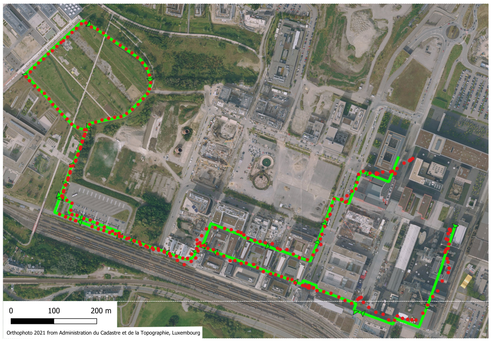

```{r setup, include=FALSE}
knitr::opts_chunk$set(echo = TRUE)
```

# GNSS accuracy & error

## Introduction

A Global Navigation Satellite System (GNSS), also commonly called a Global Positioning System (GPS) which is actually a brand of GNSS, is a relatively easy and affordable way to georeference points.
Georeferencing is the process of associating points on the surface of the Earth to a standardized coordinate system.
This allows us to say the Eiffel Tower is located at 29.9792° N, 31.1342° E using the WGS 84 geographic coordinate system.
This is typically just referred to as a latitude and longitude without any thought to what geographic coordinate system we are using.
While lat/long coordinates can be [extremely precise](https://xkcd.com/2170/) the question this resource aims to explore is how *accurate* are GNSS recording devices and what impacts their accuracy.


A brief reminder of the difference between **accuracy** and **precision**:

| Value | Measurement | Definition |
|---|---|---|
|2.4173|2.9325|Precise but not accurate|
|2.4173|2.4|Accurate but not precise|
|2.4173|2.417|Accurate and precise|

Admittedly some confusion and convergence between the two terms' meanings can occur when precision decreases for an accurate measurement (e.g., the value 2.4173 reported as 2).

See an [alternative example](https://xkcd.com/2300/).

## Outline
This resource will analyze through exploration the accuracy and error of location data collected along a walk through Belval, LUxembourg, using a GNSS device (Crosscall Trekker-M1 Core).

## A walked path
Below is a walked tour through and in the vicinity of Belval, starting in the east next to the furnaces, going along the shopping center, then to the Park to the west and returning, ending in front of the University of LUxembourg's Maison des Sciences Humaines.

Note that the walked path starts and ends in an urban area with tall structures, with some travel trough open green spaces in-between.

While a smartphone and app was used to record location, the app uses NMEA data which is not the same as typically using smartphone location data. Smartphones apps, such as Google Maps or Navigation, typically use other means to estimate location that consume less battery power: 
- proximity to cellular towers
- proximity to Wi-Fi hotspots

Requirements for needed accuracy and availability of the above determine whether GNSS processing will be used to provide accurate georeferencing.


**Figure 1: Trace of walked path.**

The path in the figure above (green line) was manually digitized using QGIS according to the route taken.

## The sensed path - GNSS data

GNSS devices decode satellite signals to determine their location. The signals contain three data parts:

- A unique identifier (the spacecraft vehicle number - SVN)
- The time the signal was sent
- The implicit location of the satellite (the orbit/ephemeris and location on it - sort of)

The decoding process locates, with some error, the device's location relative to the Earth's sea-level altitude by determining the satellites distances (a process called trilateration).
This decoding process creates a diversity of data, such as device location (lat/long), elevation, and various error measures, among others.

This generated data, in its raw form, is called NMEA data after the organization that defined the standard, the National Marine Electronics Association. There are different versions of the standard.
Rather than nicely structured, NMEA data can be quite messy or corrupted and needs further refinement before being easily usable.
Many devices and data analysis tools will process the NMEA data for you so that it is already comprehensible in data or visual form.

```
$GPGSA,A,3,02,04,05,06,07,09,11,16,20,29,30,,1.0,0.6,0.8*3B
$GPVTG,120.2,T,120.2,M,2.9,N,5.4,K,D*2C
$GPRMC,113627,A,4930.382271,N,00556.308064,E,2.9,120.2,271022,1.1,W,D*0E
$GPGGA,113627,4930.382271,N,00556.308064,E,2,11,0.6,312.0,M,48.0,M,,*47
$GPGSV,3,1,12,02,09,327,35,04,19,071,34,05,10,303,34,06,36,210,33*7D
$GPGSV,3,2,12,07,62,146,42,09,56,067,37,11,47,258,36,16,13,045,36*7A
$GPGSV,3,3,12,20,46,298,34,26,01,021,31,29,05,329,30,30,35,189,30*79
$GLGSV,2,1,08,66,14,284,28,73,17,025,40,75,30,143,41,65,63,324,33*6F
$GLGSV,2,2,08,88,30,251,37,81,29,314,27,72,46,073,35,87,06,209,*6A
```

**Code snippet 1: Some NMEA data sentences.**

We captured the NMEA sentences with an Android smartphone App called NMEA Tools Version 2.7.35.
The NMEA data was [processed using a Python script to extract](processing/extract_nmea_data.py) the lat/long points and other data. Depending on your device multiple GNSS constellations may be captured.

Besides lat/long data, NMEA data also contains:
- Relative angles of GNSS satellites visible/detected
- Satellites used to determine the sensor's location
- Error of the location measurement
- Movement speed and bearing/direction

In the figure below the lat/long points are added to the map of the walked path.

Note that point data can as easily be mapped or graphed as lines as well as points.
While using lines is beneficial in showing continuity, sequence, or direction, lines can also obscure points that communicate information, such as the accuracy of data (a straight line can either mean a straight path or missing data) or changes in speed (the difference in distance between points recorded at regular time intervals).

The maps and figures will show point and line data as appropriate.


**Figure 2: Overlay of GNSS sensed path over walked path.**

In the figure above we see the GNSS device data following closely the taken path in the western area, but less so in the south-eastern half where more buildings are present.

Temporally, in the graph below, we can see that there is a lot of deviation from the taken path at the start and end of the walk.

```{r echo=FALSE, warning=FALSE}
dferr <- read.table("gis/trace_data/BelvalWT-snap-deviation.csv", sep = ",", header = T)
dferr$dt <- strptime(paste("2022-10-27", dferr$time), format="%Y-%m-%d %H:%M:%S", tz="UTC")

# plot
par(mar=c(4,4,1,4))
plot(dferr$dt, dferr$deviation, type = "n", xlab = "Time", ylab = "Deviation from trace (m)")
abline(h=1:3*10, col="grey")
lines(dferr$dt, dferr$deviation, lwd=2)
```

**Figure 3: Plot of distance error between traced and sensed paths over time.**

## What causes error?

Since GNSS accuracy depends on receiving satellite signals, interference between these and the sensor will increase error. Buildings are a common cause of location error, but weather, forests, the atmosphere, and topography can also degrade, refract, reflect, or block satellite signals.

```{r satcount along route, echo=FALSE}

ll <- read.csv2('processing/ll_data/20221027-Crosscall-nmea.csv', sep=',')
as <- read.csv2('processing/as_data/20221027-Crosscall-nmea.csv', sep=',')

ll$dt <- strptime(paste(ll$date, ll$time), format="%Y-%m-%d %H:%M:%S Z", tz="UTC")

# merge both to get dt in as
m <- merge(ll, as, by="llid", all.x=TRUE)

#plot(m$dt, m$satused, cex=0.5, pch=19)
# too fuzzy

# smooth out the number of satellites used
filter_size = 10
m$satused_filt <- filter(m$satused, filter = rep(1/filter_size, filter_size))

par(mar=c(4,4,1,4))
plot(dferr$dt, dferr$deviation, type = "n", xlab = "Time", ylab = "Deviation from trace (m)")
abline(h=1:3*10, col="grey")
lines(dferr$dt, dferr$deviation, lwd=2)

par(new=TRUE, mar=c(4,4,1,4))
plot(m$dt, m$satused_filt, xlab = "", ylab = "", xaxt='n', yaxt='n', col="white", lwd=4, type='l')
lines(m$dt, m$satused_filt, col=4, lwd=2, type='l')
axis(4, at=0:3*4, labels = 0:3*4, col.axis=4)
mtext(side=4, line = 2, "Number of satellite used for trilateration (smoothed)", col=4)

```

**Figure 4: The error and number of satellites used to locate the sensor.**

It appears that the number of satellite signals received decreases at times of higher error.

```{r, echo=FALSE}
mv <- read.csv2('processing/mv_data/20221027-Crosscall-nmea.csv', sep=',')
mv$spd_ms <- as.numeric(mv$spd_ms)

# merge both to get dt in mv
m <- merge(ll, mv, by="llid", all.x=TRUE)

m$spd_kmh <- m$spd_ms*3.6
filter_size = 20
m$spd_filt <- filter(m$spd_kmh, filter = rep(1/filter_size, filter_size))

par(mar=c(4,4,1,4))
plot(dferr$dt, dferr$deviation, type = "n", xlab = "Time", ylab = "Deviation from trace (m)")
abline(h=1:3*10, col="grey")
lines(dferr$dt, dferr$deviation, lwd=2)

par(new=TRUE, mar=c(4,4,1,4))
plot(m$dt.x, m$spd_filt, xlab = "", ylab = "", xaxt='n', yaxt='n', col="white", lwd=4, type='l')
lines(m$dt.x, m$spd_filt, col=3, lwd=2, type='l')
axis(4, at=0:10*.6, labels = 0:10*.6, col.axis = 3)
mtext(side=4, line = 2, "Walking speed (km/h)", col=3)
```

As buildings interfere with GNSS precision let's visualize building heights along the walked route.

(ADD AN IFRAME TO CONTAIN THIS and then a link to the full page visualization)
[see GPS path and 3D buildings](https://map.geoportail.lu/theme/main?bgLayer=basemap_2015_global&version=3&zoom=14&X=661470&Y=6361338&lang=en&rotation=0&layers=&opacities=&crosshair=false&3d_layers=ACT2022_BD_L_BATI3D_LOD2%2CVDL2022_LOD2_IMPORT_old%2CBridges_LOD2%2CACT2019_LiDAR_Bridges_LOD1%2CACT2019_LiDAR_Vegetation&3d_enabled=true&3d_lon=5.94209&3d_lat=49.49240&3d_elevation=1385&3d_heading=360.000&3d_pitch=-40.388&map_id=3a4b6e155fce4f448337ebe41ed6c005&embedded=true)

We can also view this graphically by comparing surrounding heights with error.
Below, the mean height of the 50m around each recorded location is overlaid on the error.

```{r echo=FALSE, warning=FALSE}
# buildings heights data
dfs <- read.table("./gis/trace_data/BelvalWT-snap-height_stats.csv", sep = ",", header = T)
df <- merge(dferr, dfs[,c("rid", "X_count", "X_sum",  "X_mean", "X_median", "X_stdev", "X_min", "X_max")], by = "rid")

par(mar=c(4,4,1,4))
plot(df$dt, df$deviation, type = "n", lwd=2, xlab = "Time (minutes)", ylab = "Deviation from trace (m)")
abline(h=1:3*10, col="grey")
lines(df$dt, df$deviation, lwd=2)
lines(df$dt, df$X_mean, col="white", lwd=4)
lines(df$dt, df$X_mean, col=2, lwd=2)
axis(4, at=0:3*10, labels = 0:3*10, col.axis=2)
mtext(side=4,line = 2, "Surrounding mean height within 50 metres (m)", col=2)
legend('topleft', legend = c("Error distance", "Mean height of surrounding (50m) location"), lwd=2, col=c(1,2))

```
**Figure 5: Plot of surrounding building heights and error along the walked path.**

Clearly the distance between the known path and the sensed path, increases according to the surrounding structure heights.

As expected surrounding structures reduce the GNSS sensing device accuracy.

## The number of satellites

As mentioned in the introduction, GPS, is the brand of the American GNSS system. Other systems exists such as GLONASS (Russia), Baedou (China), and Galileo (EU). As location accuracy is dependent on getting good satellite reception in desirable configurations, clearly having more satellites accessible can be beneficial. Some GNSS devices can track multiple satellites types.

{width=45%}
{width=45%}

**Figure 6: Sky plots of GLONASS (left) and GPS (right) satellites in view while completing walk.**

## Dynamic satellite selection

While many satellites may be detected by a GNSS device, only up to 12 are used to calculate location. Depending on satellite reception as the device and the satellites move, the selection used changes over time.


**Figure 7: The movement and selection of satellites used during the Belval walk. The perspective**

ADD video of map view (follow leaflet app) with this overlaid in the corner

```{r GLNvsGPS lock comparison, echo=FALSE}

# we want the satellites, individually
sv <- read.csv2('processing/sv_data/20221027-Crosscall-nmea.csv', sep=',')
msv <- merge(ll, sv, by="llid", all.x=TRUE)

# m has the the data of with which satellites we've locked on to
# create an index of SVN and 
sats <- lapply(split(sv, sv$satnum), function(x) { x$satsys[1]})
sats$svn <- rownames(sats)

# extract just the count of the satellite types at different locks
satdist <- data.frame(do.call('rbind', lapply(split(msv$satsys, msv$llid), function(x) {
  #x <- split(msv$satsys, msv$llid)[[1]]
  n = length(x)
  gps = sum(x == 'GPS')
  gln = n - gps
  c(gps, gln, n)
})))

colnames(satdist) <- c('gps', 'gln', 'n')

# only keep good rows
satdist <- satdist[satdist$n < 30,]

# display which count of each satellite system/constellation is visible
# plot(jitter(satdist$gps), jitter(satdist$gln), pch=19, cex=0.5, xlim=c(5,14), ylim=c(5,14), xlab="GPS satellites visible", ylab="GLONASS satellites visible")
# we see more GPS than GLONASS generally

# let's see which satellite types are used for locks
satused_list <- lapply(split(as, as$llid), function(x) {
  #x <- split(as, as$llid)[[1]]
  
  # get the last row and just the locked sats
  lr <- x[nrow(x), paste0('s', 1:12)]
  tmp <- data.frame(satsys=c('GLN', 'GPS'))
  # convert svn to satsys
  d <- data.frame(table(unlist(sapply(lr, function(s) {
    sats[[s]]
  }))))
  satheaded <- unlist(merge(tmp, d, by.x="satsys", by.y="Var1")[,2,drop=FALSE], recursive = TRUE)
})
satused <- data.frame(do.call('rbind', satused_list))
colnames(satused) <- c('GLN', 'GPS')

par(mar=c(4,4,1,4))
plot(df$dt, df$deviation, col="white", type='n', yaxt='n', xlab='', ylab='')
abline(h=1:3*10, col="grey")
lines(df$dt, df$deviation, lwd=2, col=3)
axis(4, at=0:3*10, labels = 0:3*10, col.axis=3)
mtext(side=4,line = 2, "Deviation from trace (m)", col=3)
par(new=TRUE)
plot(filter(satused$GLN, filter=rep(1/20,20)), type='l', ylim=c(0,10), ylab="Number of satellites used for lock", xaxt='n', lwd=4, col='white')
lines(filter(satused$GLN, filter=rep(1/20,20)), col='black')
lines(filter(satused$GPS, filter=rep(1/20,20)), col='white', lwd=4)
lines(filter(satused$GPS, filter=rep(1/20,20)))

```

This is very messy. Not much to conclude from this.

## DOP measures

We have spend lots of time comparing the sensed location to the actual estimation of the travel path. Fortunately there may be an easier way.

NMEA data contains Dilution of Precision (DOP) measures. There are three:
- Vertical DOP (1D)
- Horizontal DOP (2D)
- Position DOP (3D)

Lower DOP values are better. The values can range from under 1, which are ideal, to over 20, being very poor.
Dilution of precision integrates the number and position of satellites to determine the likely accuracy of the location measurement. These measures simply take into account what we have already discussed, the number and relative position of satellites and their signals to your GNSS sensor device.

```{r DOP measures, echo=FALSE}
ll <- read.csv2('processing/ll_data/20221027-Crosscall-nmea.csv', sep=',')
as <- read.csv2('processing/as_data/20221027-Crosscall-nmea.csv', sep=',')

ll$dt <- strptime(paste(ll$date, ll$time), format="%Y-%m-%d %H:%M:%S Z", tz="UTC")

# merge both to get dt in as
m <- merge(ll, as, by="llid", all.x=TRUE)

# plot(m$dt, m$satused, cex=0.5, pch=19)
# too fuzzy

# lines(m$dt, filter(m$hdop, filter=rep(1/20,20)))

par(mar=c(4,4,2,4))
plot(dferr$dt, dferr$deviation, type = "n", lwd=2, xlab = "Time (minutes)", ylab = "Deviation from trace (m)")
abline(h=1:3*10, col="grey")
lines(dferr$dt, dferr$deviation, lwd=2)
par(new=TRUE)
plot(m$dt, filter(m$pdop, filter=rep(1/20, 20)), type='l', ylim=c(0.5, 1.2), axes=FALSE, xlab="", ylab="", col=2, lwd=2)
lines(m$dt, filter(m$hdop, filter=rep(1/20, 20)), col=3, lwd=2)
lines(m$dt, filter(m$vdop, filter=rep(1/20, 20)), col=4, lwd=2)
axis(4)
mtext("Dillution of Precision (DOP)", side=4, line = 3)
legend('top', legend = c("Deviation", "Horizontal DOP", "Vertical DOP", "PDOP"), lwd=2, col=1:4, ncol = 2)

```

Despite DOP values being labelled as 'good', the figure above shows that small increases can quickly augment the error distance. 

## Conclusion on GNSS accuracy and errors

We've explored a variety of error sources comparing them to a walked path. The intent was to highlight the lack and causes of GNSS accuracy. In practice GNSS can be used to measure certain features with non-trivial error, depending on the needs. Alternatives exist to improve accuracy, such as differential GNSS, but also more independent (i.e., non-technical) and low-tech solutions, such as measuring tapes and compasses.

## Notes


